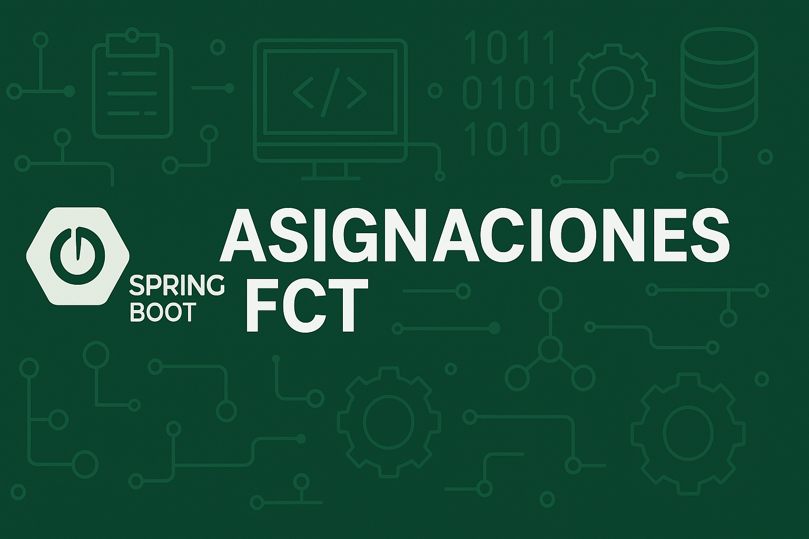

# 📌 Asignaciones FCT – Gestión de Prácticas en Empresas



## 📖 Descripción

**Asignaciones FCT** es una aplicación web desarrollada con **Spring Boot** y **Thymeleaf** para gestionar las asignaciones de alumnos a la Formación en Centros de Trabajo (FCT) en un centro educativo.

Permite que **profesores, jefatura y dirección** puedan:
- Crear solicitudes de prácticas.
- Revisar y corregir datos.
- Firmar y notificar documentos.
- Consultar el estado de las asignaciones en tiempo real.

Este proyecto fue desarrollado como **Trabajo Fin de Grado** en el ciclo formativo de **Desarrollo de Aplicaciones Web** en el **I.E.S Rey Fernando VI**.

---

## 🚀 Características principales

- 🔐 **Autenticación por roles** (Profesor, Jefatura, Dirección, Admin).
- 📄 **Gestión de solicitudes** de alumnos a empresas.
- ✅ **Validaciones de datos** (DNI, código postal, fechas, etc.).
- 📥 **Generación y envío de documentos PDF**.
- 📬 **Sistema de notificaciones internas**.
- 🛠 **Gestión de usuarios** por parte del administrador.

---

## 🛠 Tecnologías utilizadas

**Backend**  
- Java 17  
- Spring Boot (Spring MVC, Spring Dependency Injection)  
- Jakarta EE  
- Maven  

**Frontend**  
- HTML + Thymeleaf  
- Bootstrap 5  
- CSS3  
- JavaScript  

**Base de datos**  
- MySQL  

**Servidor / Desarrollo**  
- Apache (XAMPP)  
- Visual Studio Code  

**Control de versiones**  
- GitHub  

---

## 📂 Estructura del proyecto

📁 src/main/java/com/salvaceloisma/tfg <br>
├── controllers/ # Controladores Spring MVC <br>
├── models/ # Clases de modelo <br>
├── services/ # Lógica de negocio <br>
├── templates/ # Vistas Thymeleaf <br>
├── resources/ # application.properties, static, etc. <br>


---

## ⚙️ Instalación

1. **Clonar el repositorio**
```bash
git clone https://github.com/celoplay/TFG.git
cd TFG
```

2. **Configurar la base de datos**

Iniciar XAMPP (Apache + MySQL).

Crear la base de datos fct_db en MySQL.

Configurar application.properties con tus credenciales.

3. **Ejecutar el proyecto**

Desde VS Code o terminal:
```bash
mvn clean package
java -jar target/tfg-0.0.1-SNAPSHOT.jar
```
4. **Acceder a la aplicación**
```bash
   http://localhost:8080
```

## 👥 Autores
Salvador Espejo – Lógica de negocio y frontend. <br>
Marcelo Vinicio Aizaga – Gestión de archivos, rutas de usuarios y frontend. <br>
Ismael Blasco – Base de datos, validaciones y backend. <br>


## 📜 Licencia
Este proyecto está bajo la licencia **MIT**.  
Consulta el archivo [LICENSE](tfg\LICENSE) para más información.
